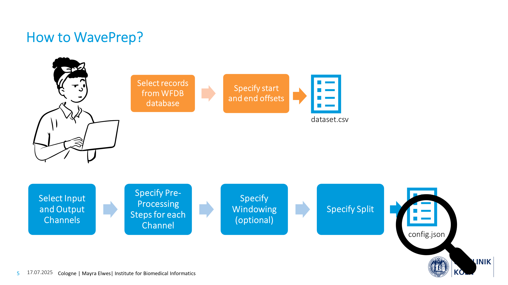
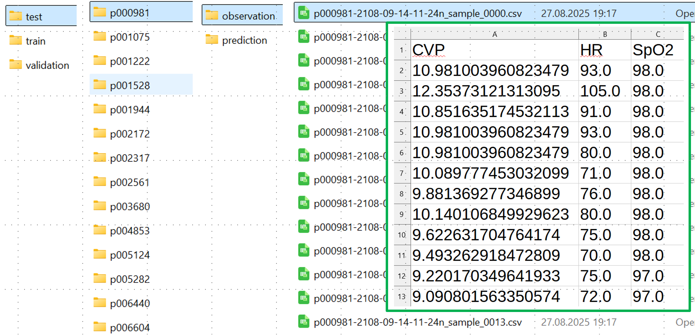

# WavePrep

WavePrep is a tool for creating machine-learning-ready signal datasets from MIMIC waveform databases. The tool allows for configuring pre-processing in a flexible, fine-grained, and channel-specific manner, supporting common signal preprocessing steps, such as downsampling, data cleaning, cutting out long nan-sequences, imputation, windowing, and splitting a dataset into training and test data. These steps can be specified via a user-friendly JSON file, lowering the entry barrier to using MIMIC waveform data. An exemplary performance analysis on a server with 80 available workers showed that the tool takes between 33.10 and 50.53 milliseconds to process 1 hour of recording when processing 6 channels. The modular, open-source tool enables researchers to add functionality according to their needs. Future work will extend this tool with a detailed dataset quality report, helping researchers create high-quality signal datasets with minimal coding. We plan to incorporate other open wfdb databases and user feedback.

To use WavePrep, the user has to provide two input files. Firstly, a CSV file specifying the selected records, along with the time span for each record that should be included in the resulting dataset. Secondly, a JSON file specifying the channels to extract from the record, the channel-specific pre-processing steps, the windowing, and the split into train, test, and validation sets. Based on these two input files, WavePrep allows the user to create their custom machine-learning-ready dataset.



WavePrep is a modular framework, developed in Python 3.12.3. The processing steps are divided into: down-sampling, data cleaning, imputation, and windowing. These step categories are implemented as abstract classes, enabling researchers to extend the framework with specific implementations of these steps. Records are processed in parallel.


For now WavePrep was developed to work with the [MIMIC III matched waveform v1.0 datset](https://physionet.org/content/mimic3wdb-matched/1.0/). The dataset consists of 10,282 Patients and 22,247 numeric records. Only 10,269 patients have at least one numeric record.

## How to WavePrep?

## 1) Provide a .csv-file that conains the records_id, start_offset and end_offest of the recording time of each record you want to create a dataset of

File Structure:

|record | offset_start_seconds | offset_end_seconds |
|-------|----------------------| -------------------|
|p000020-2183-04-28-17-47n | 0 |78899.9999998422 |
|p000033-2116-12-24-12-35n | 0 | 80819.99999983836 |

The ```record``` column should contain the record names. The ```offset_start_seconds``` contains the time after the recording began, from which timepoint on the user wants to include the record data in their dataset. Similarily ```offset_end_seconds``` specified the timepoint from which on the records data should no longer be in the dataset the user creates. So the data, that will be included in the resulting dataset, of the record is: 
```
(record_start_time + offest_start_seconds) to (record_start_time + offset_end_seconds)
```


## 2) Configure the Dataset Creation

If you want to create a dataset using WavePrep you need to specifiy the desired pre-processing steps in a ```config.json```. SO let's walk through it:

Start by specifying the basics
```
{
    ## Basic Configurations ##

    # specify the name of the wafdb database you want to create your dataset from - for now only mimic3wfdb-matched/1.0 is supported
    "database_name": "mimic3wdb-matched/1.0",
    # specify the relative path to the dataset.csv file, that includes the record ids and start and end offsets of your desired dataset
    "record_list_file": "inputs/records_with_cardiac_surgery_cpt_and_icd9.csv",

    # the channels that should be included in the observation window.
    "input_channels": [
        "CVP", "HR", "NBPSys", "NBPDias", "NBPMean", "SpO2"
    ],
    # the channels that should be included in the prediction window
    "output_channels": [
        "CVP", "HR", "NBPSys", "NBPDias", "NBPMean", "SpO2"
    ],

    # please see next section for details
    "signal_processing": [ ... ],

    # overarching pre-processing split
    "long_nan_seq_removal": [ ... ]

    ## Window Specific Configurations ##
    "windowing": { 
        ## The expected resolution at the point of windowing the data in Hz
        "expected_resolution": 0.0033333333333,
        ## The length of the observation window/prediction horizin/ prediction window in seconds
        "observation_window": 3600,
        "prediction_horizon": 0,
        "prediction_window": 300,
        ## The stepsize of the sliding window used to create the windows in seconds
        "step": 3900
     },

    ## Split Specific Configurations ##

    # the method you want to use to split your dataset - currently only group_shuffle (on subject basis) is supported
    "splitting_method": "group_shuffle",
    # random seed that will be used for the dataset split
    "random_seed": 42,

    # specifiy the ratio for your desired split here
    "train_ratio": 0.8,
    "validation_ratio": 0.00,
    "test_ratio": 0.20,

    # specify any subjects you want to exclude from the resulting dataset
    "min_samples_per_subject": 1,
    "exclude_subjects": [],
    "include_only_subjects": [],

    ## Output Specific Configurations
    "output": {
        # the directory the resulting dataset should be saved to
        "base_dir": "outputs/cardiac_surgery",
        # please do not change this
        "directory_structure": [
            "logs",
            "reports",
            "data",
            "analysis",
            "splits"
        ],
        # please do not change this
        "save_format": "csv"
    }
}
```


### 2.2) Signal Processing
Now let's have a look at the ```signal_processing``` configuration. In this part you specify pre-procesing steps that should be applied to your dataset.

Since you can specify channel-specifiy pre-processing steps, fill in the pre-processing steps for each channel individually.
```
    "signal_processing": [
        {"channel" : "CVP",
        "steps":[ ...  ]},
        {"channel" : "HR",
            "steps":[ ...  ]},
        {"channel" : "NBPSys",
        "steps":[ ...  ]
        },
        {"channel" : "NBPDias",
        "steps":[ ...  ]
        },
        {"channel" : "NBPMean",
        "steps":[ ...  ]
        },
        {"channel" : "SpO2",
        "steps":[ ...  ]
        }
    ]
```

For each channel you specify a list of steps, it is important that you number them (starting at  ````0```):
```
        {
            "step": 0,
            "downsampling": {},
            "data_cleaning": {},
            "imputation": {}
        }
```

Currently the pre-processing techniques: ```downsampling```, ```data_cleaning``` and ```imputation``` are supported. It is recommended to only choose one for each step. If there are multiple techniques in one step, they are executed in the order: ```downsampling``` -> ```data_cleaning``` -> ```imputation```.
For each technique you should specify some parameters:

```downsampling```:
```
"downsampling":{
                # the desired resulting resolution in Hz
                "desired_resolution": 0.0166666666667,
                # the downsampling strategy of your choice, currently: median, mean and decimate are supported
                "downsampling_strategy": "median"
            }
```

```data_cleaning```:
```
# for now only threshold based cleaning is supported, so any data point outside of the lower- and upper bound are replaced by nan
"data_cleaning": {
                "lower_threshold": -15.0,
                "upper_threshold": 50.0
},

```

```imputation```:
```
"imputation": {
                # specify the imputation method here, currently only a custom method "hinrichs_paper" is supported
                "method": "hinrichs_paper"
            }

```

There is one special pre-processing/data cleaning step, it is modelled to affect all channels at the same time, so it is defied out of the ```signal_processing``` defintion.  You can configure the script to "cut-out" chunks of the recordings which have more than ```max_consecutive_nans``` nans in any of the channels.
```
"long_nan_seq_removal": [
        {
            "after_step": 1,
            "max_consecutive_nans": 15
        }
    ]
```


## 3) Create Database Script

- `create_dataset.py`: This script creates the MIMIC-III Waveform Database Matched Subset.

You can run it with the command:
```bash
# To run the create script
python scripts/create_dataset.py --config configs/create/default.json
```

## 4) Output of WavePrep




## Further notes

The create dataset script will use the ThreadPoolExecutor to parallelize the creation of the records. It will automatically choose the maximum number of available workers.

Each create script run will create a new folder in the `outputs/` directory with the name of the current datetime. The folder will contain analysis, reports, logs, and mainly data folder which will have like folder names with the subject ID and the generated csv files using the records in the subject ID folder.

Splitting takes place by taking the subject IDs from the outputs/create/latest/data/ folder and then splitting them into train, validation, and test sets. The split is done using a "group shuffle" approach, which means that all records belonging to a single subject (group) are kept together in the same split (train, validation, or test). This ensures that the records of a subject are not divided across different sets, preventing data leakage between splits. For more information on group shuffle, see [GroupShuffleSplit in scikit-learn](https://scikit-learn.org/stable/modules/generated/sklearn.model_selection.GroupShuffleSplit.html).

